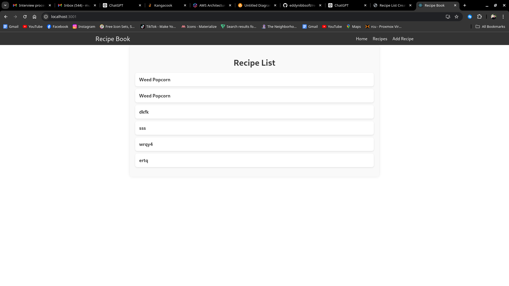
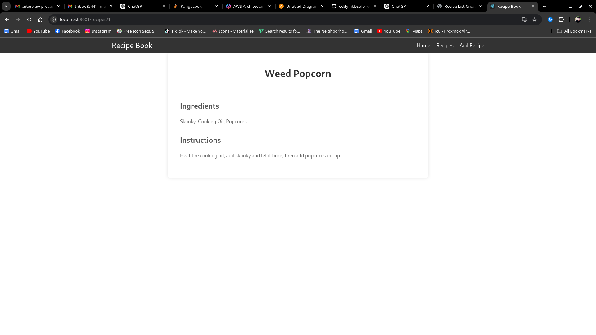
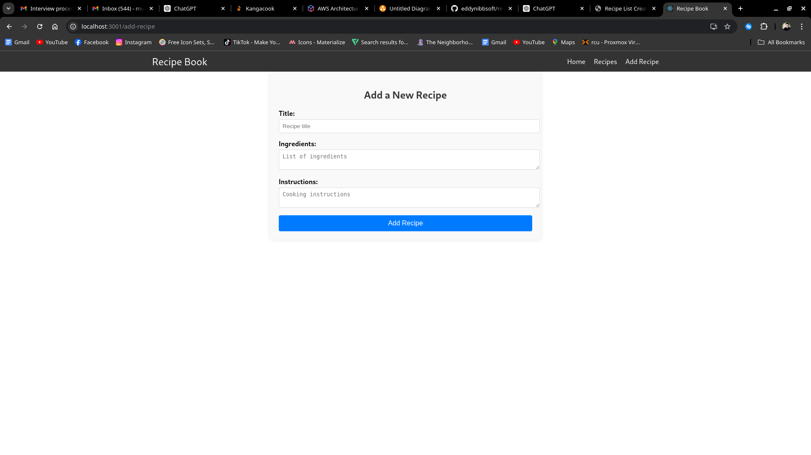
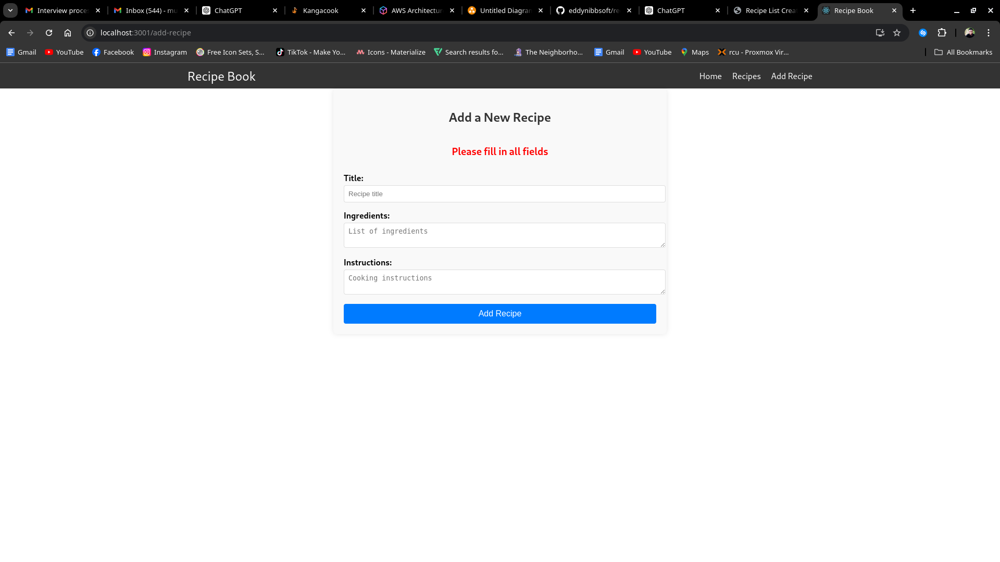
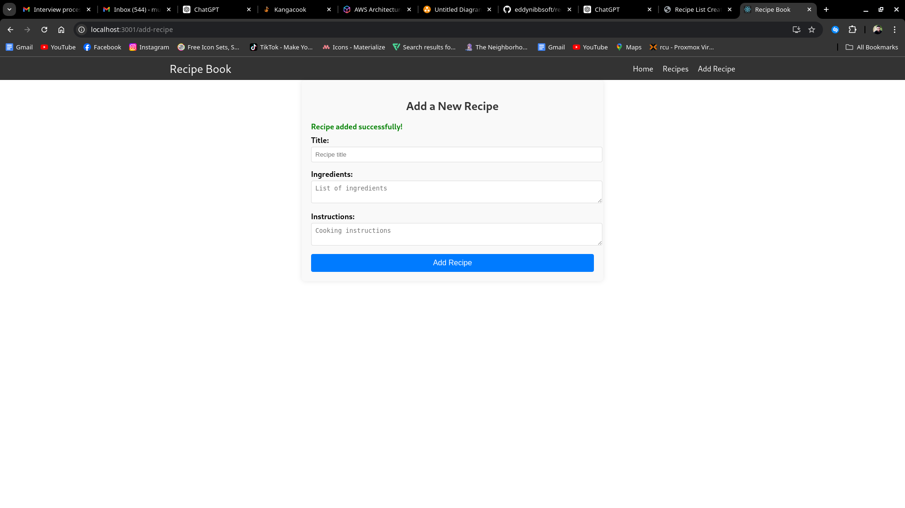
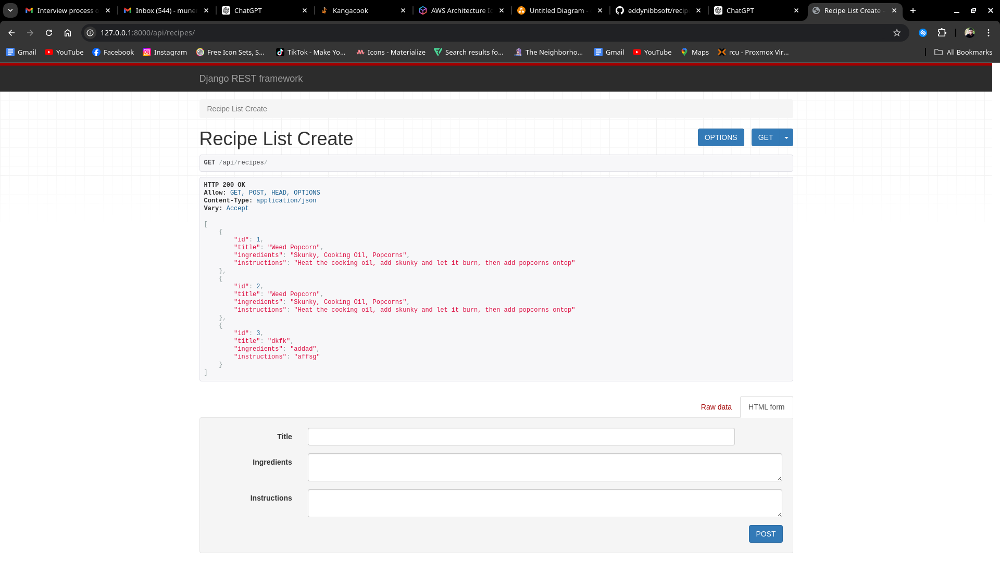

# Recipe Book

Recipe Book is a website where users can browse through a list of recipes. Each recipe can have a title, ingredients, and steps to prepare.

## Frontend

The frontend allows users to browse through recipes, view details, and add new recipes via a form.

## Backend

The Django API provides a list of recipes and their details, and allows users to add new recipes.

## Screenshots

### Homepage

### Recipe Detail Page

### Add Recipe Form

### Form Validation

### REST API TEST ON BROWSER

